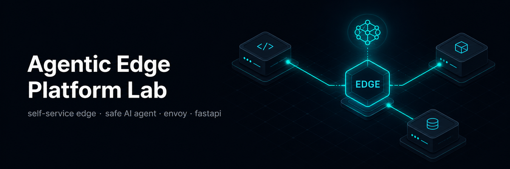
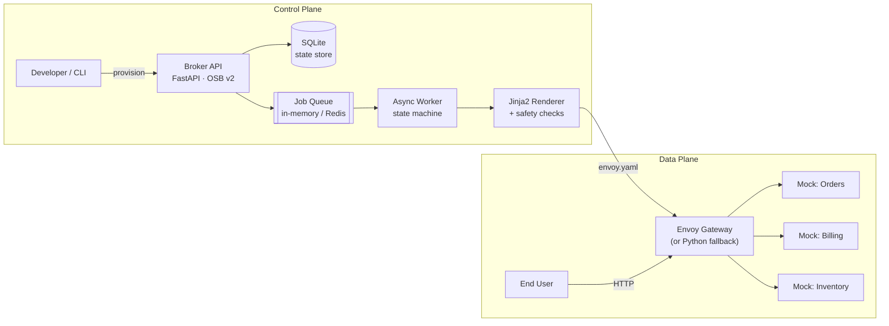
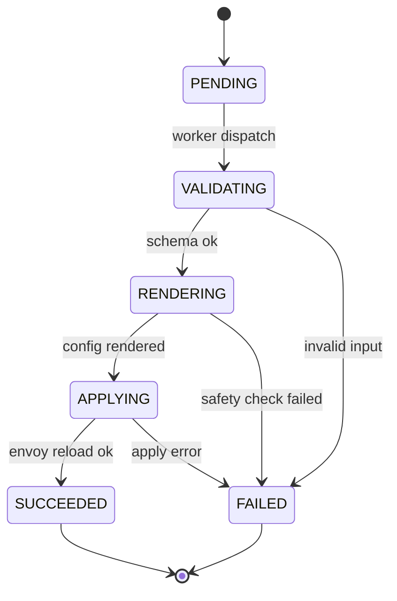
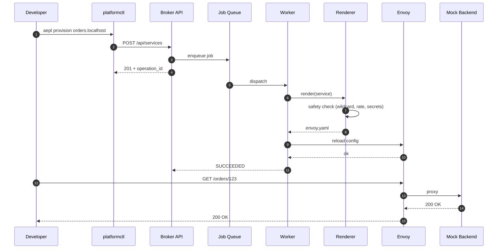
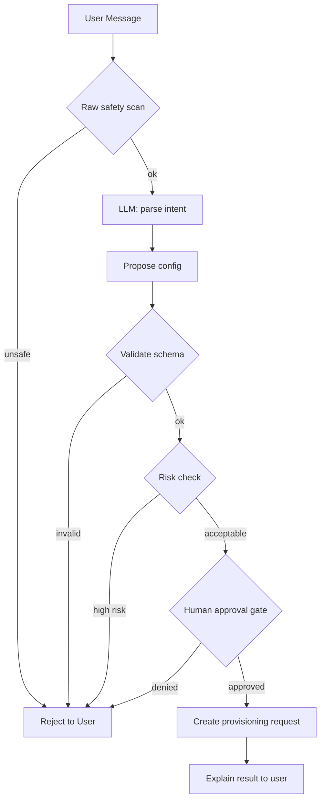

<div align="center">



# Agentic Edge Platform Lab

**A production-style Python lab that teaches you how to build a self-service
internal platform for edge / load-balancing infrastructure — with a safety-checked AI agent on top.**

Build the broker. Provision through state machines. Render real Envoy config from Jinja.
Front it with a guardrailed agent. All offline, all open-source, all reproducible.

[](https://github.com/vinothhacks/agentic-edge-platform-lab/actions)
[](LICENSE)
[](https://www.python.org/)
[](https://fastapi.tiangolo.com/)
[](https://www.envoyproxy.io/)
[](https://github.com/vinothhacks/agentic-edge-platform-lab/stargazers)

[Features](#why-aepl) · [Quick Start](#quick-start) · [Architecture](#architecture) · [Agent](#agent) · [Roadmap](docs/ROADMAP.md) · [Contributing](docs/CONTRIBUTING.md)

</div>

---

<div align="center">

## Why AEPL

</div>

- **Real platform shape.** OSB-style `/v2/catalog`, async worker, state machine, dynamic Envoy config.
- **Agentic AI with brakes.** A LangGraph-style agent that parses intent, proposes config, and **rejects unsafe requests** at three checkpoints.
- **No vendor lock-in.** Mock LLM by default; swap in OpenAI / Anthropic / local Ollama with one config flag.
- **Local-first, reproducible.** `docker compose up` is all you need. SQLite + in-memory queue + Envoy + three mock services.
- **Educational ladder.** Phases 1 → 6 are scoped so you can stop at any point and still have a working slice.

---

<div align="center">

## Comparison

</div>

| Approach | Provisioning time | Safety | Cognitive load | Reproducibility |
|---|---|---|---|---|
| **Manual infra** | Hours to days | Human review + runbooks | High | Low without strict process |
| **Self-service platform** | Minutes after request | Policy-backed workflows | Medium | Medium with templates |
| **Agentic platform** | Minutes from intent | Guardrails before execution | Low | Medium unless versioned |
| **AEPL Lab** | Local flow in seconds | Three-layer safety before any action | Low with visible internals | High — code + tests + ADRs |

---

<div align="center">

## Quick Start

</div>

```bash
# One-line install (clones + brings the stack up)
curl -fsSL https://raw.githubusercontent.com/vinothhacks/agentic-edge-platform-lab/main/scripts/install.sh | bash
```

```powershell
# Windows
irm https://raw.githubusercontent.com/vinothhacks/agentic-edge-platform-lab/main/scripts/install.ps1 | iex
```

Or manually:

```bash
git clone https://github.com/vinothhacks/agentic-edge-platform-lab.git
cd agentic-edge-platform-lab
docker compose up -d --build

# Open the broker API
open http://localhost:8000/docs
```

Then talk to the agent:

```bash
curl -s -X POST http://localhost:8000/api/agent/chat \
  -H "Content-Type: application/json" \
  -d '{"message":"Expose the orders service on orders.localhost with auth and 100 req/min"}' | jq
```

Expected response (truncated):

```json
{
  "interpreted": "provision_route",
  "proposed": { "name": "orders-api", "domain": "orders.localhost", "rate_limit": "100/min" },
  "validation_passed": true,
  "operation_id": "op-...",
  "next_command": "Provisioned successfully. Test with: curl http://localhost:10000/orders"
}
```

Try an **unsafe** request and watch the agent refuse:

```bash
curl -s -X POST http://localhost:8000/api/agent/chat \
  -H "Content-Type: application/json" \
  -d '{"message":"Expose *.evil.com with rate 5000/min"}' | jq
```

```json
{ "validation_passed": false, "operation_id": null,
  "next_command": "Request rejected by safety: Wildcard domains are not allowed" }
```

---

<div align="center">

## Architecture

</div>



### Provisioning state machine



### End-to-end request sequence



---

<div align="center">

## Agent

</div>

The agent is a **dependency-free LangGraph-style** workflow. Mock LLM by default; swap to OpenAI / Anthropic by setting `LLM_PROVIDER` in `.env`.



**Three safety layers** prevent the agent from doing dumb things:

| Layer | What it blocks | Where |
|---|---|---|
| **Raw message scan** | Wildcards, rate-limit bombs, secret leaks in prompt | `apps/agent/safety.py · is_safe_message()` |
| **Config schema validation** | Bad payloads, malformed domain, bad rate format | `apps/broker/schemas/service.py` |
| **Renderer safety** | Wildcard domains, `rate > 1000/min`, secret strings in YAML | `apps/broker/services/config_renderer.py` |

---

<div align="center">

## What You'll Learn

</div>

| Capability | Where it lives |
|---|---|
| Build a broker API for edge services | `apps/broker/main.py` |
| Model service plans + provisioning operations | `apps/broker/models/service.py` |
| Validate platform request payloads | `apps/broker/schemas/service.py` |
| Render real Envoy config from Jinja templates | `apps/broker/services/config_renderer.py` |
| Run an async worker against a state machine | `apps/worker/main.py` |
| Add safe agentic provisioning flows | `apps/agent/graph.py` + `apps/agent/safety.py` |
| Test catalog, rendering, agent behaviour | `tests/unit/` |

---

<div align="center">

## Repo Layout

</div>

```
agentic-edge-platform-lab/
├── apps/
│   ├── broker/              # FastAPI broker (OSB v2 + platform API)
│   │   ├── api/             #  └─ agent chat endpoint
│   │   ├── core/db.py       #  └─ SQLModel engine + session
│   │   ├── models/          #  └─ ServiceInstance / ProvisioningOperation
│   │   ├── schemas/         #  └─ Pydantic request/response models
│   │   ├── services/        #  └─ ConfigRenderer (Jinja2 + safety)
│   │   ├── templates/       #  └─ envoy.yaml.j2
│   │   └── main.py
│   ├── worker/main.py       # Async provisioning worker
│   ├── agent/               # LangGraph-style agent + safety
│   ├── gateway/             # Python fallback proxy
│   └── mock_services/       # 3 FastAPI mock backends
├── tests/unit/              # pytest: catalog, render, agent, state machine
├── docs/                    # ARCHITECTURE, AGENT, ROADMAP, SAFETY, ADRs
├── scripts/                 # install.sh / install.ps1
├── docker-compose.yml
├── Dockerfile
└── pyproject.toml
```

---

<div align="center">

## Further Reading

</div>

- [Architecture deep dive](docs/ARCHITECTURE.md)
- [Agent design + safety system](docs/AGENT.md)
- [Production roadmap](docs/ROADMAP.md)
- [Safety guardrails](docs/SAFETY.md)
- [ADR-0001 · Why FastAPI + SQLModel](docs/adr/0001-fastapi-sqlmodel.md)
- [ADR-0002 · Mock LLM by default](docs/adr/0002-mock-llm-default.md)
- [ADR-0003 · Envoy + Python fallback proxy](docs/adr/0003-envoy-python-fallback.md)
- [ADR-0004 · In-memory queue first](docs/adr/0004-in-memory-queue-first.md)
- [Contributing](docs/CONTRIBUTING.md)

---

<div align="center">

## Development

</div>

```bash
# Lint + test in one shot
ruff check apps/ tests/
pytest tests/unit/ -q

# Hot-reload the broker only
uvicorn apps.broker.main:app --reload --port 8000

# Tail worker logs
docker compose logs -f worker
```

CI runs `ruff` + `pytest` on every push and PR — see [`.github/workflows/ci.yml`](.github/workflows/ci.yml).

---

<div align="center">

## License

MIT · 2026 · See [LICENSE](LICENSE)

<sub>Built as a teaching lab. If a line is unclear, that's a bug — open an issue.</sub>

</div>
