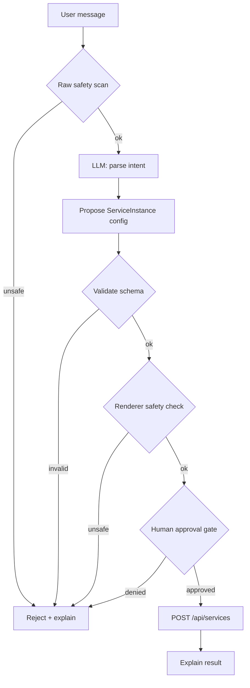

# Agent

The AEPL agent translates a natural-language request like *"expose the orders service on `orders.localhost` with auth and 100 req/min"* into a valid, safe provisioning request — and refuses to do anything dangerous.

## Design goals

1. **Dependency-free.** No LangGraph, no LangChain, no agent framework. A 60-line state machine.
2. **Swappable LLM.** Mock by default, OpenAI / Anthropic / Ollama as drop-in adapters.
3. **Safety at three layers.** Pre-LLM, post-LLM, pre-render. Any layer can veto.
4. **Inspectable.** Every step's state is visible in the response: `interpreted`, `proposed`, `validation_passed`, `operation_id`, `next_command`.

## Workflow



## State

```python
@dataclass
class AgentState:
    raw_message: str
    parsed_intent: dict | None
    proposed_config: dict | None
    validation_errors: list[str]
    risk_level: str
    approval_status: str
    operation_id: str | None
    final_response: str | None
```

## Safety layers

| Layer | File | Catches |
|---|---|---|
| Raw message scan | `apps/agent/safety.py · is_safe_message()` | `*`, secrets in prompt, rate ≥ 2000/min before LLM ever sees it |
| Schema validation | `apps/broker/schemas/service.py` | Wrong types, missing fields, bad domain format |
| Renderer safety | `apps/broker/services/config_renderer.py` | Final guardrail — never writes an unsafe `envoy.yaml` |

Any layer can short-circuit the workflow. The agent **always** returns a structured response — never a stack trace.

## LLM providers

| Provider | Config | Notes |
|---|---|---|
| Mock (default) | none | Deterministic intent parser, used in tests |
| OpenAI | `LLM_PROVIDER=openai`, `OPENAI_API_KEY=...` | Function-calling style |
| Anthropic | `LLM_PROVIDER=anthropic`, `ANTHROPIC_API_KEY=...` | Tool use |
| Ollama | `LLM_PROVIDER=ollama`, `OLLAMA_URL=...` | Local; great for offline labs |

The adapter interface is in `apps/agent/llm.py`. Adding a new provider = one function.

## Example: unsafe rejection

```bash
curl -s -X POST localhost:8000/api/agent/chat -d '{"message":"Expose *.evil.com with rate 5000/min"}' -H "Content-Type: application/json"
```

```json
{
  "interpreted": "unknown",
  "proposed": {},
  "validation_passed": false,
  "operation_id": null,
  "next_command": "Request rejected by safety: Unsafe request detected in message: Wildcard domains are not allowed"
}
```

The request never reaches the LLM. Layer 1 stopped it.

## Extending

- **Add a tool** — new function in `apps/agent/tools.py`, call from `graph.py`.
- **Tighten a rule** — edit `UNSAFE_PATTERNS` in `safety.py`.
- **Add an approval channel** — replace the inline `approval_status` with a Slack/email gate before `create_provisioning_request`.
