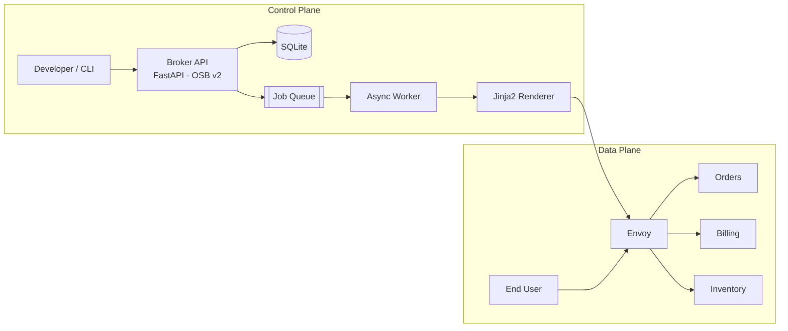
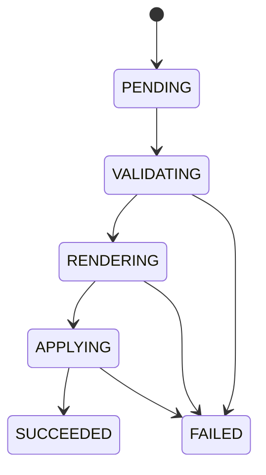

# Architecture

AEPL is split into a **control plane** (the platform that knows about services) and a **data plane** (the gateway that actually moves user traffic). Every component is replaceable — every choice is documented in an [ADR](adr/).

## High-level

## Components

### Broker API (`apps/broker/`)

The control surface. Speaks two dialects:

- **OSB v2** — `/v2/catalog`, `/v2/service_instances/{id}/last_operation`. Compatible with the [Open Service Broker spec](https://www.openservicebrokerapi.org/) so a real Kubernetes service catalog could talk to it unchanged.
- **Platform API** — `/api/services` CRUD + `/api/agent/chat`. The ergonomic surface developers and the CLI actually use.

Each `POST /api/services` writes a `ServiceInstance` row + a `ProvisioningOperation` row (state = `PENDING`) and returns immediately. The worker takes it from there.

### State store (`apps/broker/core/db.py`)

SQLite via SQLModel. Two tables matter:

| Table | Purpose |
|---|---|
| `service_instances` | The desired state of every edge route |
| `provisioning_operations` | The audit log + current job state for each provision |

Production swap: PostgreSQL — change one connection string.

### Job queue + worker (`apps/worker/main.py`)

In-memory polling worker that scans `provisioning_operations` for rows in `PENDING`. Each job moves through the state machine:

Production swap: Redis + Celery / RQ. The worker code is intentionally provider-agnostic.

### Renderer (`apps/broker/services/config_renderer.py`)

Takes a `ServiceInstance` and produces real Envoy YAML via Jinja2. Three safety checks happen here before any file is written:

1. Reject `*` in the domain.
2. Reject rate-limits above `1000/min`.
3. Reject empty / malformed `rate_limit` strings.

The output goes to `generated/<service-name>.yaml`. In production this would be pushed to an Envoy xDS server.

### Gateway (`apps/gateway/local_proxy.py` + Envoy in compose)

Two interchangeable data-plane options:

- **Envoy** (default in `docker-compose.yml`) — the real thing. Reads `generated/*.yaml` and reloads.
- **Python fallback** — a tiny `httpx`-based reverse proxy. Useful for CI and machines where Envoy is overkill.

### Agent (`apps/agent/`)

A LangGraph-style state machine, written without LangGraph so it stays dependency-free and easy to read. See [AGENT.md](AGENT.md).

### Mock backends (`apps/mock_services/`)

Three FastAPI apps (`orders`, `billing`, `inventory`) so you have realistic upstreams to route to. Each exposes `/healthz` and one domain endpoint.

## Request flow (provisioning)

See the sequence diagram in the [README](../README.md#end-to-end-request-sequence).

## Trade-offs

| Choice | Why we made it | When to swap |
|---|---|---|
| SQLite | Zero-setup, one file, perfect for a lab | Move to Postgres when you need concurrent writers |
| In-memory queue | No Redis dependency for the smallest demo | Move to Redis when worker count > 1 |
| Mock LLM | Reproducible, no API key required | Wire `LLM_PROVIDER=openai` for real reasoning |
| Envoy via static config | Real edge proxy, no xDS complexity | Add go-control-plane / xDS when route count > 50 |

## Where to dive in next

- Read the [agent design](AGENT.md).
- Read the [safety system](SAFETY.md).
- Look at [ADR-0001](adr/0001-fastapi-sqlmodel.md) for the data-plane choice.
